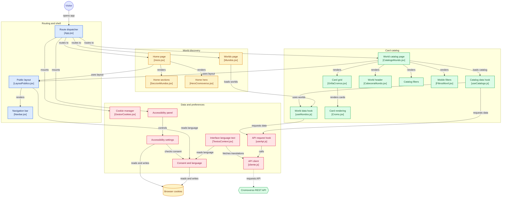

```mermaid
%% Generated by https://gitdiagram.com/naticasta777-ai/cromoverso
flowchart TD

subgraph group_routing["Routing and shell"]
  node_app["Route dispatcher<br/>[App.jsx]"]
  node_public_layout["Public layout<br/>[LayoutPublico.jsx]"]
  node_navbar["Navigation bar<br/>[Navbar.jsx]"]
end

subgraph group_discovery["World discovery"]
  node_home["Home page<br/>[Inicio.jsx]"]
  node_worlds["Worlds page<br/>[Mundos.jsx]"]
  node_home_sections["Home sections<br/>[SeccionMundos.jsx]"]
  node_home_hero["Home hero<br/>[HeroCromoverso.jsx]"]
end

subgraph group_catalog["Card catalog"]
  node_catalog_page["World catalog page<br/>[CatalogoMundo.jsx]"]
  node_catalog_hook["Catalog data hook<br/>[useCatalogo.js]"]
  node_world_hook["World data hook<br/>[useMundos.js]"]
  node_world_header["World header<br/>[CabeceraMundo.jsx]"]
  node_filters["Catalog filters"]
  node_mobile_filters["Mobile filters<br/>[FiltrosMovil.jsx]"]
  node_card_grid["Card grid<br/>[GrillaCromos.jsx]"]
  node_card["Card rendering<br/>[Cromo.jsx]"]
end

subgraph group_shared["Data and preferences"]
  node_api_hook["API request hook<br/>[useApi.js]"]
  node_api_client["API client<br/>[cliente.js]"]
  node_text_context["Interface language text<br/>[TextosContext.jsx]"]
  node_preferences["Consent and language"]
  node_accessibility["Accessibility settings"]
  node_cookie_manager["Cookie manager<br/>[GestorCookies.jsx]"]
  node_accessibility_panel["Accessibility panel"]
end

node_visitor(("Visitor"))
node_service{{"Cromoverso REST API"}}
node_cookie_storage[("Browser cookies")]

node_visitor -->|"opens app"| node_app
node_app -->|"routes to"| node_home
node_app -->|"routes to"| node_worlds
node_app -->|"routes to"| node_catalog_page
node_home -->|"renders"| node_home_hero
node_home -->|"renders"| node_home_sections
node_worlds -->|"loads worlds"| node_world_hook
node_catalog_page -->|"loads catalog"| node_catalog_hook
node_catalog_page -->|"renders"| node_world_header
node_catalog_page -->|"renders"| node_filters
node_catalog_page -->|"renders"| node_mobile_filters
node_catalog_page -->|"renders"| node_card_grid
node_card_grid -->|"renders cards"| node_card
node_catalog_hook -->|"uses worlds"| node_world_hook
node_catalog_hook -->|"requests data"| node_api_hook
node_world_hook -->|"requests data"| node_api_hook
node_api_hook -->|"calls"| node_api_client
node_api_client -.->|"requests API"| node_service
node_home -->|"uses layout"| node_public_layout
node_catalog_page -->|"uses layout"| node_public_layout
node_public_layout -->|"renders"| node_navbar
node_text_context -->|"fetches translations"| node_api_client
node_text_context -->|"reads language"| node_preferences
node_public_layout -->|"reads language"| node_preferences
node_app -->|"mounts"| node_cookie_manager
node_app -->|"mounts"| node_accessibility_panel
node_accessibility_panel -->|"controls"| node_accessibility
node_accessibility -->|"checks consent"| node_preferences
node_preferences -->|"reads and writes"| node_cookie_storage
node_accessibility -->|"reads and writes"| node_cookie_storage

click node_app "https://github.com/naticasta777-ai/cromoverso/blob/main/src/App.jsx"
click node_home "https://github.com/naticasta777-ai/cromoverso/blob/main/src/pages/Inicio.jsx"
click node_worlds "https://github.com/naticasta777-ai/cromoverso/blob/main/src/pages/Mundos.jsx"
click node_home_sections "https://github.com/naticasta777-ai/cromoverso/blob/main/src/components/SeccionMundos/SeccionMundos.jsx"
click node_home_hero "https://github.com/naticasta777-ai/cromoverso/blob/main/src/components/HeroCromoverso/HeroCromoverso.jsx"
click node_catalog_page "https://github.com/naticasta777-ai/cromoverso/blob/main/src/pages/CatalogoMundo.jsx"
click node_catalog_hook "https://github.com/naticasta777-ai/cromoverso/blob/main/src/hooks/useCatalogo.js"
click node_world_hook "https://github.com/naticasta777-ai/cromoverso/blob/main/src/hooks/useMundos.js"
click node_api_hook "https://github.com/naticasta777-ai/cromoverso/blob/main/src/hooks/useApi.js"
click node_api_client "https://github.com/naticasta777-ai/cromoverso/blob/main/src/api/cliente.js"
click node_world_header "https://github.com/naticasta777-ai/cromoverso/blob/main/src/components/CabeceraMundo/CabeceraMundo.jsx"
click node_filters "https://github.com/naticasta777-ai/cromoverso/blob/main/src/components/BarraLateralMundo/BarraLateralMundo.jsx"
click node_mobile_filters "https://github.com/naticasta777-ai/cromoverso/blob/main/src/components/FiltrosMovil/FiltrosMovil.jsx"
click node_card_grid "https://github.com/naticasta777-ai/cromoverso/blob/main/src/components/GrillaCromos/GrillaCromos.jsx"
click node_card "https://github.com/naticasta777-ai/cromoverso/blob/main/src/components/Cromo/Cromo.jsx"
click node_public_layout "https://github.com/naticasta777-ai/cromoverso/blob/main/src/components/LayoutPublico/LayoutPublico.jsx"
click node_navbar "https://github.com/naticasta777-ai/cromoverso/blob/main/src/components/Navbar/Navbar.jsx"
click node_text_context "https://github.com/naticasta777-ai/cromoverso/blob/main/src/context/TextosContext.jsx"
click node_preferences "https://github.com/naticasta777-ai/cromoverso/blob/main/src/context/PreferenciasContext.jsx"
click node_accessibility "https://github.com/naticasta777-ai/cromoverso/blob/main/src/context/AccesibilidadContext.jsx"
click node_cookie_manager "https://github.com/naticasta777-ai/cromoverso/blob/main/src/components/GestorCookies/GestorCookies.jsx"
click node_accessibility_panel "https://github.com/naticasta777-ai/cromoverso/blob/main/src/components/PanelAccesibilidad/PanelAccesibilidad.jsx"

classDef toneNeutral fill:#f8fafc,stroke:#334155,stroke-width:1.5px,color:#0f172a
classDef toneBlue fill:#dbeafe,stroke:#2563eb,stroke-width:1.5px,color:#172554
classDef toneAmber fill:#fef3c7,stroke:#d97706,stroke-width:1.5px,color:#78350f
classDef toneMint fill:#dcfce7,stroke:#16a34a,stroke-width:1.5px,color:#14532d
classDef toneRose fill:#ffe4e6,stroke:#e11d48,stroke-width:1.5px,color:#881337
classDef toneIndigo fill:#e0e7ff,stroke:#4f46e5,stroke-width:1.5px,color:#312e81
classDef toneTeal fill:#ccfbf1,stroke:#0f766e,stroke-width:1.5px,color:#134e4a
class node_app,node_public_layout,node_navbar toneBlue
class node_home,node_worlds,node_home_sections,node_home_hero,node_cookie_storage toneAmber
class node_catalog_page,node_catalog_hook,node_world_hook,node_world_header,node_filters,node_mobile_filters,node_card_grid,node_card,node_service toneMint
class node_api_hook,node_api_client,node_text_context,node_preferences,node_accessibility,node_cookie_manager,node_accessibility_panel toneRose
class node_visitor toneIndigo
```